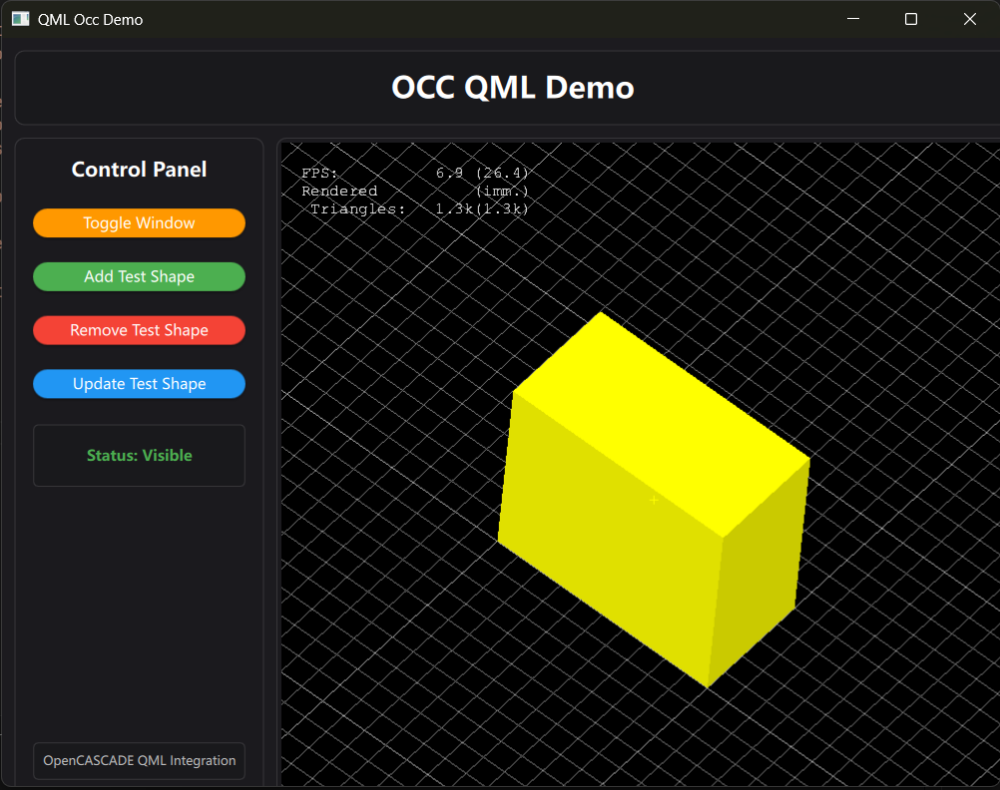

# OCCT QML Integration Demo

This project demonstrates the integration of Open CASCADE Technology (OCCT) 3D viewer with Qt Quick/QML framework.

## Overview

This demo shows how to embed OCCT 3D viewer within a QML application using custom QQuickItem. The implementation provides a bridge between OCCT's OpenGL rendering and Qt's QML scene graph.



*Screenshot showing OCCT 3D viewer integrated within QML application*

## Features

- OCCT 3D viewer integration with QML
- Custom QQuickItem for OpenGL rendering
- Qt6 compatibility
- Cross-platform support (Windows, macOS, Linux)

## Building

Use CMake to build the project:

```bash
mkdir build && cd build
cmake ..
make
```

## Dependencies

- Qt6 (Core, Quick, OpenGL, Gui, Qml)
- OpenCASCADE Technology (OCCT)

## Related Resources

For OCCT integration with Qt Widgets (QWidget/QOpenGLWidget), please refer to the official OCCT samples by the OCCT development team:

[OCCT Qt Widgets Samples](https://github.com/gkv311/occt-samples-qopenglwidget)

This repository provides comprehensive examples of OCCT integration with Qt Widgets framework, including both QWidget and QOpenGLWidget approaches.

## License

This project is provided as a demonstration of OCCT and QML integration techniques.
